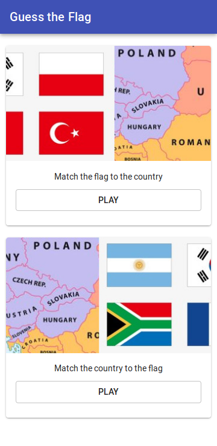
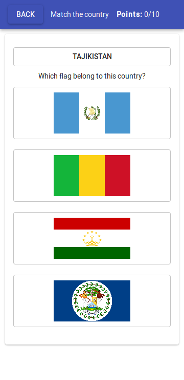
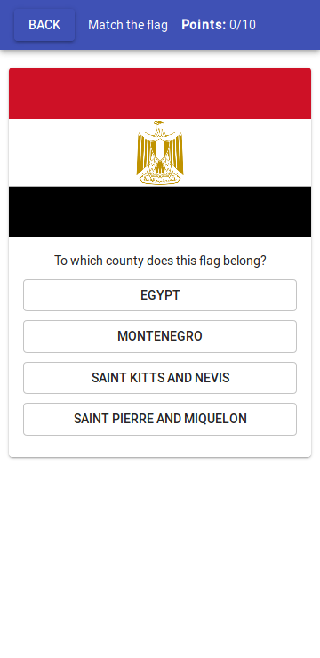

# Guess the Flag - Quiz

This project was bootstrapped with [Create React App](https://github.com/facebook/create-react-app).

## Runs the app in development mode

`yarn start` or `npm start`

##  Builds the app for production to the build folder.

`yarn build` or `npm build`

##  Flags source

`https://github.com/hjnilsson/country-flags`

## Main menu

## Match the country to the flag

## Match the flag to the country
